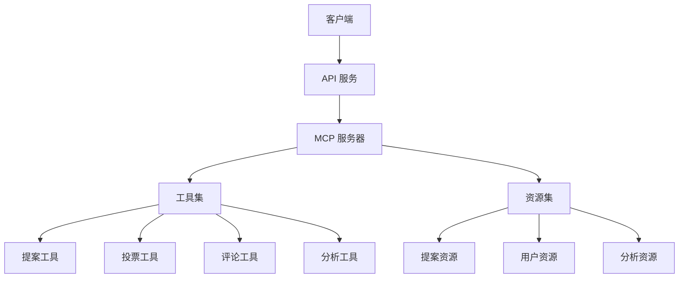
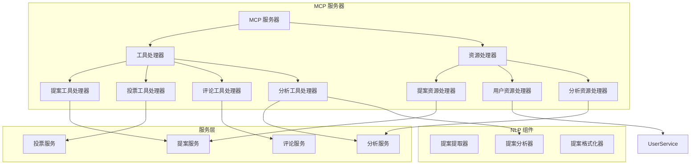

# 提案系统 MCP 架构设计

## 当前架构

当前的提案系统采用传统的模块化架构，主要组件包括：

1. **API 层**：处理 HTTP 请求和响应
2. **Agent 层**：协调各个组件的工作
3. **NLP 组件**：处理自然语言处理任务，如提案提取、分析和格式化
4. **服务层**：提供业务逻辑功能
5. **模型层**：定义数据结构
6. **工具层**：提供可复用的工具功能

## MCP 架构设计

将系统重构为 MCP (Model Context Protocol) 架构，可以提供更灵活的工具和资源访问方式，使 AI 模型能够更有效地与系统交互。

### MCP 架构概述



### MCP 服务器设计

MCP 服务器将作为系统的核心组件，提供标准化的工具和资源接口。

#### 工具设计

MCP 服务器将提供以下工具：

1. **提案工具**
   - `create_proposal`: 创建新提案
   - `update_proposal`: 更新提案
   - `list_proposals`: 列出提案
   - `search_proposals`: 搜索提案

2. **投票工具**
   - `vote_proposal`: 对提案投票
   - `get_vote_stats`: 获取投票统计

3. **评论工具**
   - `add_comment`: 添加评论
   - `list_comments`: 列出评论

4. **分析工具**
   - `analyze_proposal`: 分析提案
   - `generate_vote_recommendation`: 生成投票建议
   - `generate_comment`: 生成评论

#### 资源设计

MCP 服务器将提供以下资源：

1. **提案资源**
   - URI 模板: `proposal://{proposal_id}`
   - 提供提案的详细信息

2. **用户资源**
   - URI 模板: `user://{user_id}`
   - 提供用户的详细信息

3. **分析资源**
   - URI 模板: `analysis://{proposal_id}`
   - 提供提案分析结果

### 代码架构



## 文件结构设计

```
proposal/
├── mcp/
│   ├── __init__.py
│   ├── server.py                # MCP 服务器主类
│   ├── tools/
│   │   ├── __init__.py
│   │   ├── proposal_tools.py    # 提案相关工具
│   │   ├── vote_tools.py        # 投票相关工具
│   │   ├── comment_tools.py     # 评论相关工具
│   │   └── analysis_tools.py    # 分析相关工具
│   └── resources/
│       ├── __init__.py
│       ├── proposal_resources.py # 提案资源
│       ├── user_resources.py     # 用户资源
│       └── analysis_resources.py # 分析资源
├── api/
│   ├── __init__.py
│   ├── proposal_api.py          # API 端点
│   └── mcp_api.py               # MCP API 端点
├── services/                    # 保持原有服务层
├── models/                      # 保持原有模型层
├── nlp/                         # 保持原有 NLP 组件
└── config.py                    # 配置文件
```

## MCP 服务器实现示例

### MCP 服务器主类

```python
#!/usr/bin/env python
from modelcontextprotocol.sdk.server import Server
from modelcontextprotocol.sdk.server.stdio import StdioServerTransport
from modelcontextprotocol.sdk.types import (
    CallToolRequestSchema,
    ErrorCode,
    ListResourcesRequestSchema,
    ListResourceTemplatesRequestSchema,
    ListToolsRequestSchema,
    McpError,
    ReadResourceRequestSchema,
)

from proposal.mcp.tools.proposal_tools import ProposalTools
from proposal.mcp.tools.vote_tools import VoteTools
from proposal.mcp.tools.comment_tools import CommentTools
from proposal.mcp.tools.analysis_tools import AnalysisTools
from proposal.mcp.resources.proposal_resources import ProposalResources
from proposal.mcp.resources.user_resources import UserResources
from proposal.mcp.resources.analysis_resources import AnalysisResources

class ProposalMCPServer:
    """提案系统 MCP 服务器"""
    
    def __init__(self):
        """初始化 MCP 服务器"""
        self.server = Server(
            {
                "name": "proposal-mcp-server",
                "version": "0.1.0",
            },
            {
                "capabilities": {
                    "resources": {},
                    "tools": {},
                }
            }
        )
        
        # 初始化工具和资源处理器
        self.proposal_tools = ProposalTools()
        self.vote_tools = VoteTools()
        self.comment_tools = CommentTools()
        self.analysis_tools = AnalysisTools()
        
        self.proposal_resources = ProposalResources()
        self.user_resources = UserResources()
        self.analysis_resources = AnalysisResources()
        
        # 设置请求处理器
        self._setup_tool_handlers()
        self._setup_resource_handlers()
        
        # 错误处理
        self.server.onerror = lambda error: print(f"[MCP Error] {error}")
    
    def _setup_tool_handlers(self):
        """设置工具处理器"""
        self.server.setRequestHandler(ListToolsRequestSchema, self._handle_list_tools)
        self.server.setRequestHandler(CallToolRequestSchema, self._handle_call_tool)
    
    def _setup_resource_handlers(self):
        """设置资源处理器"""
        self.server.setRequestHandler(ListResourcesRequestSchema, self._handle_list_resources)
        self.server.setRequestHandler(ListResourceTemplatesRequestSchema, self._handle_list_resource_templates)
        self.server.setRequestHandler(ReadResourceRequestSchema, self._handle_read_resource)
    
    async def _handle_list_tools(self, request):
        """处理列出工具请求"""
        tools = []
        
        # 添加提案工具
        tools.extend(self.proposal_tools.get_tools())
        
        # 添加投票工具
        tools.extend(self.vote_tools.get_tools())
        
        # 添加评论工具
        tools.extend(self.comment_tools.get_tools())
        
        # 添加分析工具
        tools.extend(self.analysis_tools.get_tools())
        
        return {"tools": tools}
    
    async def _handle_call_tool(self, request):
        """处理调用工具请求"""
        tool_name = request.params.name
        arguments = request.params.arguments
        
        # 根据工具名称分发到相应的处理器
        if tool_name.startswith("proposal_"):
            return await self.proposal_tools.call_tool(tool_name, arguments)
        elif tool_name.startswith("vote_"):
            return await self.vote_tools.call_tool(tool_name, arguments)
        elif tool_name.startswith("comment_"):
            return await self.comment_tools.call_tool(tool_name, arguments)
        elif tool_name.startswith("analysis_"):
            return await self.analysis_tools.call_tool(tool_name, arguments)
        else:
            raise McpError(ErrorCode.MethodNotFound, f"Unknown tool: {tool_name}")
    
    async def _handle_list_resources(self, request):
        """处理列出资源请求"""
        resources = []
        
        # 添加静态资源
        resources.extend(self.proposal_resources.get_static_resources())
        resources.extend(self.user_resources.get_static_resources())
        resources.extend(self.analysis_resources.get_static_resources())
        
        return {"resources": resources}
    
    async def _handle_list_resource_templates(self, request):
        """处理列出资源模板请求"""
        templates = []
        
        # 添加资源模板
        templates.extend(self.proposal_resources.get_resource_templates())
        templates.extend(self.user_resources.get_resource_templates())
        templates.extend(self.analysis_resources.get_resource_templates())
        
        return {"resourceTemplates": templates}
    
    async def _handle_read_resource(self, request):
        """处理读取资源请求"""
        uri = request.params.uri
        
        # 根据 URI 分发到相应的处理器
        if uri.startswith("proposal://"):
            return await self.proposal_resources.read_resource(uri)
        elif uri.startswith("user://"):
            return await self.user_resources.read_resource(uri)
        elif uri.startswith("analysis://"):
            return await self.analysis_resources.read_resource(uri)
        else:
            raise McpError(ErrorCode.InvalidRequest, f"Invalid URI format: {uri}")
    
    async def run(self):
        """运行 MCP 服务器"""
        transport = StdioServerTransport()
        await self.server.connect(transport)
        print("Proposal MCP server running on stdio")

# 运行服务器
if __name__ == "__main__":
    import asyncio
    
    server = ProposalMCPServer()
    asyncio.run(server.run())
```

### 提案工具实现示例

```python
from typing import Dict, Any, List
from modelcontextprotocol.sdk.types import McpError, ErrorCode

from proposal.services.proposal_service import ProposalService

class ProposalTools:
    """提案相关工具"""
    
    def __init__(self):
        """初始化提案工具"""
        self.proposal_service = ProposalService()
    
    def get_tools(self) -> List[Dict[str, Any]]:
        """获取提案工具列表"""
        return [
            {
                "name": "proposal_create",
                "description": "创建新提案",
                "inputSchema": {
                    "type": "object",
                    "properties": {
                        "title": {
                            "type": "string",
                            "description": "提案标题"
                        },
                        "content": {
                            "type": "string",
                            "description": "提案内容"
                        },
                        "creator_id": {
                            "type": "string",
                            "description": "创建者 ID"
                        },
                        "tags": {
                            "type": "array",
                            "items": {
                                "type": "string"
                            },
                            "description": "提案标签"
                        }
                    },
                    "required": ["title", "content", "creator_id"]
                }
            },
            {
                "name": "proposal_list",
                "description": "列出提案",
                "inputSchema": {
                    "type": "object",
                    "properties": {
                        "status": {
                            "type": "string",
                            "description": "提案状态过滤"
                        },
                        "limit": {
                            "type": "number",
                            "description": "返回结果数量限制"
                        }
                    }
                }
            },
            {
                "name": "proposal_get",
                "description": "获取提案详情",
                "inputSchema": {
                    "type": "object",
                    "properties": {
                        "proposal_id": {
                            "type": "string",
                            "description": "提案 ID"
                        }
                    },
                    "required": ["proposal_id"]
                }
            },
            {
                "name": "proposal_search",
                "description": "搜索提案",
                "inputSchema": {
                    "type": "object",
                    "properties": {
                        "query": {
                            "type": "string",
                            "description": "搜索关键词"
                        },
                        "tags": {
                            "type": "array",
                            "items": {
                                "type": "string"
                            },
                            "description": "标签过滤"
                        },
                        "limit": {
                            "type": "number",
                            "description": "返回结果数量限制"
                        }
                    },
                    "required": ["query"]
                }
            }
        ]
    
    async def call_tool(self, tool_name: str, arguments: Dict[str, Any]):
        """调用提案工具"""
        if tool_name == "proposal_create":
            return await self._create_proposal(arguments)
        elif tool_name == "proposal_list":
            return await self._list_proposals(arguments)
        elif tool_name == "proposal_get":
            return await self._get_proposal(arguments)
        elif tool_name == "proposal_search":
            return await self._search_proposals(arguments)
        else:
            raise McpError(ErrorCode.MethodNotFound, f"Unknown tool: {tool_name}")
    
    async def _create_proposal(self, arguments: Dict[str, Any]):
        """创建提案"""
        try:
            title = arguments.get("title")
            content = arguments.get("content")
            creator_id = arguments.get("creator_id")
            tags = arguments.get("tags", [])
            
            if not title or not content or not creator_id:
                raise McpError(ErrorCode.InvalidParams, "Missing required parameters")
            
            proposal = self.proposal_service.create_proposal(
                title=title,
                content=content,
                creator_id=creator_id,
                tags=tags
            )
            
            return {
                "content": [
                    {
                        "type": "text",
                        "text": f"提案创建成功，ID: {proposal.get('proposal_id')}"
                    }
                ]
            }
        except Exception as e:
            raise McpError(ErrorCode.InternalError, f"创建提案失败: {str(e)}")
    
    async def _list_proposals(self, arguments: Dict[str, Any]):
        """列出提案"""
        try:
            status = arguments.get("status")
            limit = arguments.get("limit", 10)
            
            proposals = self.proposal_service.list_proposals(status=status, limit=limit)
            
            return {
                "content": [
                    {
                        "type": "text",
                        "text": f"找到 {len(proposals)} 个提案"
                    },
                    {
                        "type": "json",
                        "json": proposals
                    }
                ]
            }
        except Exception as e:
            raise McpError(ErrorCode.InternalError, f"列出提案失败: {str(e)}")
```

### 提案资源实现示例

```python
from typing import Dict, Any, List
import re
from modelcontextprotocol.sdk.types import McpError, ErrorCode

from proposal.services.proposal_service import ProposalService

class ProposalResources:
    """提案资源处理器"""
    
    def __init__(self):
        """初始化提案资源处理器"""
        self.proposal_service = ProposalService()
    
    def get_static_resources(self) -> List[Dict[str, Any]]:
        """获取静态资源列表"""
        # 这里可以返回一些热门提案作为静态资源
        return [
            {
                "uri": "proposal://featured/latest",
                "name": "最新精选提案",
                "mimeType": "application/json",
                "description": "最新的精选提案列表"
            }
        ]
    
    def get_resource_templates(self) -> List[Dict[str, Any]]:
        """获取资源模板列表"""
        return [
            {
                "uriTemplate": "proposal://{proposal_id}",
                "name": "提案详情",
                "mimeType": "application/json",
                "description": "根据 ID 获取提案详情"
            }
        ]
    
    async def read_resource(self, uri: str) -> Dict[str, Any]:
        """读取提案资源"""
        try:
            # 处理特殊资源
            if uri == "proposal://featured/latest":
                return await self._get_featured_proposals()
            
            # 处理提案详情
            match = re.match(r"proposal://([^/]+)$", uri)
            if match:
                proposal_id = match.group(1)
                return await self._get_proposal_by_id(proposal_id)
            
            raise McpError(ErrorCode.InvalidRequest, f"无效的 URI 格式: {uri}")
        except Exception as e:
            if isinstance(e, McpError):
                raise e
            raise McpError(ErrorCode.InternalError, f"读取提案资源失败: {str(e)}")
    
    async def _get_featured_proposals(self) -> Dict[str, Any]:
        """获取精选提案"""
        try:
            proposals = self.proposal_service.list_proposals(limit=5, sort_by="created_at", sort_order="desc")
            
            return {
                "contents": [
                    {
                        "uri": "proposal://featured/latest",
                        "mimeType": "application/json",
                        "text": json.dumps(proposals, ensure_ascii=False)
                    }
                ]
            }
        except Exception as e:
            raise McpError(ErrorCode.InternalError, f"获取精选提案失败: {str(e)}")
    
    async def _get_proposal_by_id(self, proposal_id: str) -> Dict[str, Any]:
        """根据 ID 获取提案"""
        try:
            proposal = self.proposal_service.get_proposal(proposal_id)
            
            if not proposal:
                raise McpError(ErrorCode.NotFound, f"未找到提案: {proposal_id}")
            
            return {
                "contents": [
                    {
                        "uri": f"proposal://{proposal_id}",
                        "mimeType": "application/json",
                        "text": json.dumps(proposal, ensure_ascii=False)
                    }
                ]
            }
        except Exception as e:
            if isinstance(e, McpError):
                raise e
            raise McpError(ErrorCode.InternalError, f"获取提案失败: {str(e)}")
```

## MCP API 集成

为了将 MCP 服务器集成到现有的 API 中，我们需要创建一个新的 API 端点来处理 MCP 请求。

```python
# proposal/api/mcp_api.py
from fastapi import FastAPI, Request, Response
import asyncio
from proposal.mcp.server import ProposalMCPServer

# 创建 MCP 服务器实例
mcp_server = ProposalMCPServer()

# 启动 MCP 服务器
@app.on_event("startup")
async def startup_mcp_server():
    # 在后台运行 MCP 服务器
    asyncio.create_task(mcp_server.run())

# MCP 请求处理端点
@app.post("/api/mcp")
async def handle_mcp_request(request: Request):
    # 获取请求体
    body = await request.json()
    
    # 处理 MCP 请求
    result = await mcp_server.server.handle_request(body)
    
    # 返回结果
    return Response(content=result, media_type="application/json")
```

## 主应用集成

最后，我们需要在主应用中集成 MCP 服务器。

```python
# main.py
import uvicorn
import asyncio
from proposal.api.proposal_api import app
from proposal.config import settings
from proposal.mcp.server import ProposalMCPServer

if __name__ == "__main__":
    try:
        # 验证配置
        settings.validate()
        
        # 设置环境变量
        settings.setup_environment()
        
        # 启动服务
        uvicorn.run(
            "proposal.api:app",
            host=settings.API_HOST,
            port=settings.API_PORT,
            reload=settings.DEBUG
        )
    except Exception as e:
        print(f"启动失败: {str(e)}")
```

## 总结

通过将提案系统重构为 MCP 架构，我们可以实现以下优势：

1. **标准化接口**：MCP 提供了标准化的工具和资源接口，使 AI 模型能够更容易地与系统交互。
2. **灵活性**：MCP 架构允许我们动态添加新的工具和资源，而无需修改核心代码。
3. **可扩展性**：通过 MCP 服务器，我们可以轻松地将系统与其他 AI 模型和服务集成。
4. **解耦**：MCP 架构将系统的不同部分解耦，使代码更易于维护和扩展。

通过这种架构，AI 模型可以更有效地与提案系统交互，执行创建提案、投票、评论和分析等操作，从而提高系统的整体效率和用户体验。
